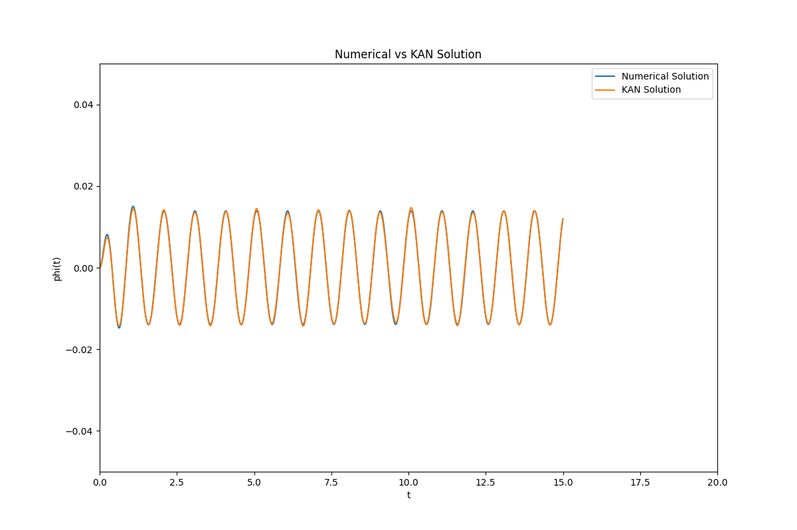

# Parameters used to train KAN for gamma = 0.8

Gamma:
```
gamma_val = 0.8
```

Time points for numerical solution: 
15,000 time points from 0 to 15 
```
t = np.linspace(0, 15, 15000)
```

LSODA SciPy numerical solver used to solve differental eq. :
```
sol = solve_ivp(driven_damped_pendulum, [t[0], t[-1]], y0, args=(omega_val, lambda_val, gamma_val, Omega_val), t_eval=t, method='LSODA', rtol=1e-6, atol=1e-8)
```


Training points for KAN:
```
x_physics = torch.linspace(0, 15, 10000).view(-1,1).requires_grad_(True) # sample locations over the problem domain
```

Weights and Dimensions of KAN:
```
physics_weight = 1e-3
model = KAN(width=[1,15,15,1], grid=5, k=3, seed=0)
```
KAN trained over 14,500 epochs:
```
epochs = 14500
```

